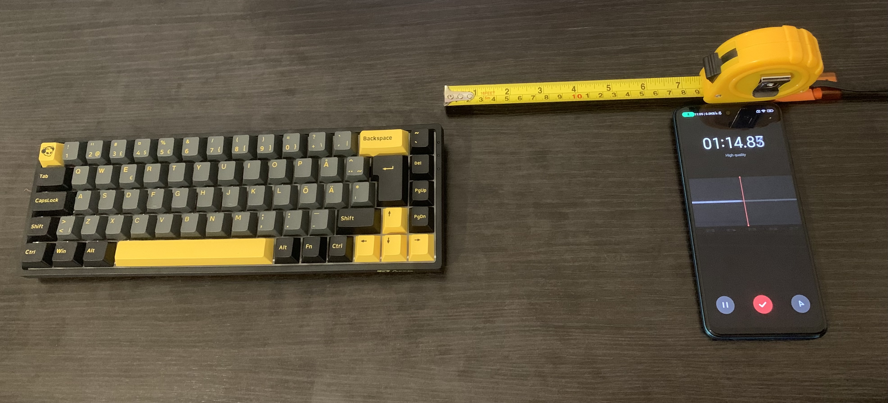

# kad
Keystroke Acoustic Dataset (KAD)

Welcome to the official repository for the Keystroke Acoustic Dataset (KAD) dataset, a comprehensive audio dataset designed for keystroke classification research.
We are pleased to present a new dataset for keystroke attack research, now available on GitHub. This dataset comprises four distinct collections, recorded using the microphone of a smartphone and based on the methodology outlined by Harrison et al. [1].

# Desk experiment setup

This is the experiment setup for keystroke with a mechanical keyboard.
The smartphone is at 17cm from the keyboard position.

# Dataset Overview

The first dataset includes audio recordings of keystrokes from a MacBook Pro keyboard and is publicly accessible on GitHub [2]. 
Building upon this, three additional datasets were created by varying typing speed and energy to simulate diverse real-world scenarios. 
Each of these three datasets contains 900 audio files, with 75 .wav files for each of the 36 keys (letters a-z and numbers 0-9). After applying data augmentation techniques, the number of audio files in each dataset expands to 2,700.

To provide a comprehensive benchmark, the datasets were recorded using three different keyboards: a Huawei MateBook D14 keyboard, a soft keyboard, and a mechanical keyboard.
In this repository there is only the mechanical dataset, recorded with the above desk setup.
Keystroke audio was captured at three typing speeds (0.1 seconds, 0.5 seconds, and 1 second) with varying typing intensities. For segmentation, each audio file was processed to isolate keystroke sounds, with the start of the segment aligned to the peak time and the end set one second before the click sound, as determined experimentally.

This extensive dataset supports the evaluation of various models and techniques for detecting and analyzing keystroke sounds under realistic conditions. Full details, including the segmentation process and folder organization, are available alongside the dataset.

# Citation
If you use the BioVid dataset in your research, please provide proper citation.

# References

[1] J. Harrison, E. Toreini and M. Mehrnezhad, "A Practical Deep Learning-Based Acoustic Side Channel Attack on Keyboards," in 2023 IEEE European Symposium on Security and Privacy Workshops (EuroS&PW), Delft, Netherlands, (2023) pp. 270-280.

[2] J. Harrison, et al. Keystroke-Datasets https://github.com/JBFH-Dev/Keystroke-Datasets (2023)

# Acknowledgments
Thank you to all participants for their contributions and to the team for their efforts in data collection and processing.

We look forward to seeing how this dataset advances the field of multimodal learning and speaker identification!
