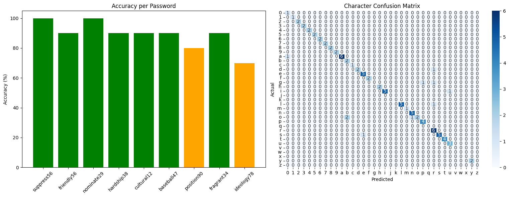
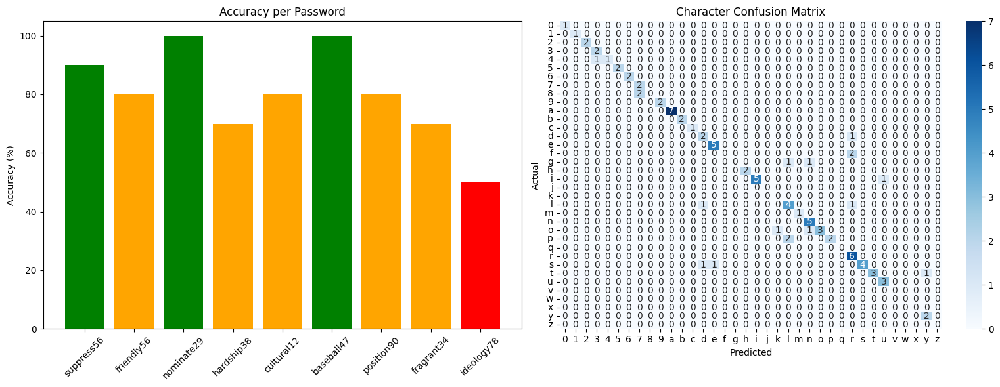
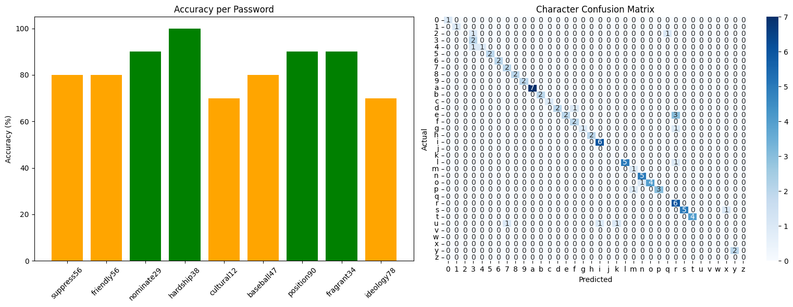

```{python}
#| include: false
import torch
import librosa as lb
import numpy as np
import plotly.express as px
from plotly.subplots import make_subplots
import plotly.graph_objects as go
from utils.dataset import KeyAudioDataset
import plotly.io as pio
import plotly.graph_objects as go

neon_dark_theme = go.layout.Template(
    layout=go.Layout(
        font=dict(
            family="'Inter', 'Segoe UI', Roboto, sans-serif", 
            color="#e2e2e2" 
        ),
        
        title=dict(
            font=dict(color="#ffffff", size=24) 
        ),
        
        plot_bgcolor="rgba(0,0,0,0)",  
        paper_bgcolor="rgba(0,0,0,0)", 
        
        colorway=["#00d2ff", "#ff0055", "#4fd1c5", "#b794f4"], 
        
        xaxis=dict(
            showgrid=True, 
            gridcolor="#333333", 
            linecolor="#333333", 
            zerolinecolor="#333333",
            tickfont=dict(color="#a0a0b0")
        ),
        yaxis=dict(
            showgrid=True, 
            gridcolor="#333333", 
            linecolor="#333333", 
            zerolinecolor="#333333",
            tickfont=dict(color="#a0a0b0")
        ),
        
        hoverlabel=dict(
            bgcolor="#0d0d14",
            bordercolor="#00d2ff",
            font=dict(
                family="'Inter', 'Segoe UI', Roboto, sans-serif", 
                color="#e2e2e2"
            )
        )
    )
)

pio.templates["neon_dark"] = neon_dark_theme
pio.templates.default = "neon_dark"
```

## Introduction: The Problem

::: {.incremental}
* **Traditional Threat:** Software-based Keyloggers (Internal malware capturing OS inputs).
* **The New Frontier:** Acoustic Side Channel Attacks (ASCA).
* **The Core Question:** Can AI decipher what we type just by listening from the outside?
* <span class="alert">Implications:</span>
  * Severe privacy and cybersecurity risks.
  * Everyday threat to billions of users worldwide

::: {style="height: 75px;"}
:::
* **Project Goal:** Build and test a highly accurate AI model to evaluate if acoustic keylogging is a realistic, everyday threat.
:::


## Dataset: What kind of data are we using?

The original dataset is made of:

- One `.wav` record per alphanumerical key, 25 clicks each, for a total of **900** samples. 
- Audio recorded using the **Akko 306B Plus ISO mechanical keyboard,** with the microphone of a smartphone placed on the **left, with distance of 17 cm.**
- Test set composed by **9 passwords** composed sequentially.

::: {.callout-note title="Context Matters"}
Audio signals are highly dependent on their recording context. Variations in the source keyboard, microphone distance, or room acoustics can change or worsen inference accuracy.
:::


## Dataset: Peak detection algorithm

The splitting process was done by 2 specific functions: One for detect peaks, the other to perform the splitting at that peak. Let's look at `peak_detection()`, which analyze the audio to find when the loud peaks happen.

::: {.incremental}
* **Loads audio file** using `librosa`.
* Uses **Wavelet Transform:** with `pywt.cwt` to pinpoint sudden changes in signals across different frequencies while keeping track of time.
* **Calculate a baseline** "noise level" by looking at the average amplitude of the first second of the audio. It then sets a `threshold` that is 5 times louder.
* It steps through the audio, detecting **sudden jumps** in the signal (checks if the diff between the current frame and the previous one exceeds the threshold), it registers that moment as a `peak_time`.
* Once a peak is found, it **skips forward** by `gap_time` (0.5 seconds). This prevents the script from triggering multiple times on fading out sound.
* At the end, it **passes the list of collected** `peak_times` to the `split_audio` function.
:::

## Dataset: Splitting algorithm

The `split_audio()` takes the timestamps found by the previous function and does the actual cutting and saving.

::: {.incremental}
* **It re-loads the audio** using `pydub.AudioSegment`.
* For every `peak_time` handed to it, **it calculates a start and end time.** 
    * The chunk **starts exactly at the peak.**
    * The chunk **ends `gap_time - 0.1` seconds later** (which equates to 0.4 seconds total length based on the 0.5s gap time defined in the other function).
* It saves each sliced chunk into the **specified output directory** (`outdir`).
:::


## 0 Full Wav Example


```{python}
test, _ = lb.load('mechanical_keyboard_dataset/0.wav', sr=8000)
fig = px.line(test, render_mode='webgl')
fig.update_layout(
        xaxis_title= "Time", 
        yaxis_title= "Signal",
        title= 'Raw Signal example',
        showlegend=False,
        autosize=True
    )

onset_samples = lb.onset.onset_detect(y=test, sr=8000, units='samples', backtrack=True)

box_width = 3000  

for i, onset in enumerate(onset_samples):
    if i != 0:
        fig.add_vrect(
            x0=onset - 500,
            x1=onset + (box_width - 500),
            fillcolor="darkred",
            opacity=0.5,
            layer="below",
            line_width=1.5,
            line_dash="dash",
            line_color="darkred",
        )

fig.show()
```

## Split Example

```{python}
test, _ = lb.load('dataset_split/train/0_1.wav', sr=8000)
fig = px.line(test, render_mode='webgl')
fig.update_layout(
        xaxis_title= "Time", 
        yaxis_title= "Signal",
        title= 'Raw Split example',
        showlegend=False,
        autosize=True
    )

fig.show()

```


## Dataset: Augmentation Pipeline

Since the ammount of data is not enough to train a Deep NN model, we must rely on a data agumentation pipeline. The augmentation done are the following:

::: {.incremental}
1. Adds **Gaussian noise** with variance within a defined high/low dB range. Variance computed as $SNR = 10\log_{10}{\Big(}\frac{E(Sig^2)}{E(Noise^2)}{\Big)} \rightarrow E(Noise^2) = E(Sig^2)/10^{\frac{SNR}{10}}$
2. **Shifts signal** across the time axis, in order to emulate different **typing speed.**
3. **Scale the amplitude** of the signal with an uniform multiplier to emulate different possible **typing volume.**
:::

## Augmentation Visualization

```{python}
sr = 8000
raw, _ = lb.load('dataset_split/train/0_1.wav', sr=sr)
aug, _ = lb.load('dataset_split/train/dataset_2/aug_0_1_1.wav', sr=sr)

time_raw = np.arange(len(raw)) / sr
time_aug = np.arange(len(aug)) / sr

fig = make_subplots(
    rows=2, cols=1, 
    shared_xaxes=True, 
    vertical_spacing=0.08,
    subplot_titles=("Raw Split Example", "Augmented Split Example")
)

fig.add_trace(
    go.Scatter(x=time_raw, y=raw, mode='lines', name='Raw'),
    row=1, col=1
)

fig.add_trace(
    go.Scatter(x=time_aug, y=aug, mode='lines', name='Aug'),
    row=2, col=1
)

fig.update_layout(
    title_text="Audio Signal Comparison",
    showlegend=False,
    autosize=True,
    height=600 
)

fig.update_yaxes(title_text="Amplitude", row=1, col=1)
fig.update_yaxes(title_text="Amplitude", row=2, col=1)
fig.update_xaxes(title_text="Time (seconds)", row=2, col=1) 

fig.show()

```


## How is the data injected to the nets? {.smaller}


:::: {.columns}

::: {.column width="50%"}
* Data Splitting, Augmentation & Label Encoding

  * Data is divided into an **80/20 train/validation** split using sklearn, ensuring balanced class **stratification.**

  * Applies the **data augmentation** pipeline only on **train set.**

  * Uses a **LabelEncoder** to convert the categorical string labels into standardized integers for **loss function computation.**

:::


::: {.column width="50%"}
* Dataset class

  * Turns possible stereo audio into **mono.**
  
  * Resamples all audio to a strict **48kHz** standard.
  
  * The raw 1D audio signal is transformed into a 2D **Mel Spectrogram (128 mel bands, 49 hops).** This represents the audio's frequency content over time.
  
  * **Time and Frequency Masking** are applied for training samples.
:::

::::

## Mel Spectrogram Visualization

```{python}
torch.manual_seed(2)
torch.cuda.manual_seed(2)
test_dataset = KeyAudioDataset(
    file_paths=['dataset_split/train/dataset_2/aug_0_1_1.wav'], 
    labels=[0], 
    is_train=True,
    is_plot=True
)

mel_tensor, label = test_dataset[0]

mel_numpy = mel_tensor.squeeze().numpy()

fig = px.imshow(
    mel_numpy, 
    origin='lower',
    aspect='auto',
    labels=dict(x="Time Frames", y="Mel Frequency Bins", color="Amplitude (std dB)"),
)

fig.update_layout(autosize=True)

fig.show()
```

## Training Loops

| Hyperparam | TCN | LSTM | CRNN |
|:---|:---:|:---:|:---:|
| Batch size | 32 | 32 | 32 |
| Learning Rate | 0.001 | 0.0001 | 0.0001 |
| Epochs | 50 | 100 | 100 |
| LrScheduler | 0.5 | 0.5 | 0.5 |
| Early Stopping | 10 | 20 | 20 |
: Train loop comparison

## Main Building Block: Causal Convolution layers


## Main Building Block: Causal Convolution layers


## Residual Blocks


## Deep Dive: Causal Convolutions & Residual Blocks

* **TemporalCausal1D (Real-Time Validity):** 
  * Prevents data leakage from the future. The kernel at time $t$ only sees current and past signals.
  * Achieved via dynamic **left-padding** based on kernel size and dilation rate.
  * Employs **Weight Normalization** to stabilize training.

* **Custom Residual Block:**
  * Two consecutive Causal Convolution layers, each followed by **ReLU** and **Dropout**.
  * Adds the original input back to the output to prevent vanishing gradients, using a $1\times1$ convolution to align channel dimensions if they change.
  * Applies a final **ReLU** and **Dropout** to the combined residual output.

## First Architecture: TCN

::: {.incremental}
* Sequence of **four** residual blocks one after the other.
  * Constant number of filters channels per layer: **128**.
  * Constant kernel size per convolution layer: **3**.
  * Dropout percentage: **20%**
  * **ReLU** activation function throughput.

* An **Adaptive Average Pooling** layer collapses the temporal dimension before a **Fully Connected Layer** generates the final classification scores.

:::

::: {style="height: 50px;"}
:::

::: {.fragment}
Overall Accuracy on test set: <span class="alert">89%</span>
:::

##



## Recurrent based models: Main building block


## Second Architecture: LSTM

::: {.incremental}
* Feature Summarizer: **Two layers** of Long Short-Term Memory (LSTM) cells.
  * Hidden state dimensionality: **128**.
  * Inter-layer Dropout: **30%**
  * Bidirectional.

* Layer Normalization with `norm_shape = hidden_size * 2` 

* **Global Max Pooling** applied across the time dimension to extract the most important signals from the hidden states.

* **Classifier block** made of Two Fully Connected Layers, with ReLU and Dropout in between.
:::

::: {style="height: 50px;"}
:::

::: {.fragment}
Overall Accuracy on test set: <span class="alert">80%</span>
:::

##



## Third Architecture: CRNN

::: {.incremental}
* Mixed CNN and RNN structure:
  * **Feature extractor:** Three residual blocks with:

    * Constant number of neurons channels per layer: **128**.
    * Constant kernel size per convolution layer: **3**.
    * Dropout percentage: **20%**
    * **ReLU** activation function

  * **Feature summarizer:** One LSTM layer

    * Number of hidden state dimensionality: **64**
    * Inter-layer Dropout: **20%**
    * Bidirectional.

    * **Max pooling** applied to outputs to capture the most important features over time.

  * **Classifier:** Two Fully Connected Layers.

:::

::: {style="height: 50px;"}
:::

::: {.fragment}
Overall Accuracy on test set: <span class="alert">83%</span>
:::

##



## Comparison { .smaller }

:::: {.columns}

::: {.column width="40%"}

| Metric | TCN | LSTM | CRNN |
|:---|:---:|:---:|:---:|
| Accuracy | 89% | 80% | 83% |
| MacroF1 | 0.8869 | 0.7484 | 0.7419 |
| Params | 399k | 697k | 406k |
: Train loop comparison

> Although excluded from the final results, a **CoatNet** model was also trained, with worse performances than **LSTM**

:::

::: {.column width="60%"}
#### Considerations
* Causal Convolutional Layers are exceptionally **well-suited for rapid, concentrated transients** in audio signals.
* All three architectures maintain a **lean parameter footprint** with good performances. 
* LSTM faces a **complexity ceiling.** Increasing its depth leads to **vanishing gradient** problem, causing performance to degrade.
* For this specific dataset and sample size, simplicity is a key factor. Hungrier models, suffer from **data starvation,** whereas these models generalize without overfitting.
:::

::::

## Possible Next steps

::: {.incremental}

* **Dataset Expansion:** Broaden the model's exposure by collecting data across different acoustic environments and keyboards.

* **Continuous Sequence Modeling:** While the TCN excels at isolated, transient keystrokes, the CRNN could be better suited for continuous typing streams. 
  The Convolutional part can detect the signature of a specific button, while the LSTM models the temporal sequence of characters.

* **NLP Integration:** Combine these classifiers with Natural Language Processing techniques, such as N-gram models, to contextually correct misclassified characters. 
  While open-source tools (like [Keytap](https://github.com/ggerganov/kbd-audio)) do this using classic signal processing, pairing NLP with deep learning models could improve performances.

* **Two-Stage Denoising Pipeline:** Introduce a frontend "cleaner" model to scrub environmental noise. 
  This allows the system to process highly noisy, realistic audio samples without sacrificing the classifier's performance.

:::

::: {style="text-align: center; margin-top: 250px;"}
## **Thanks for listening!**
:::


